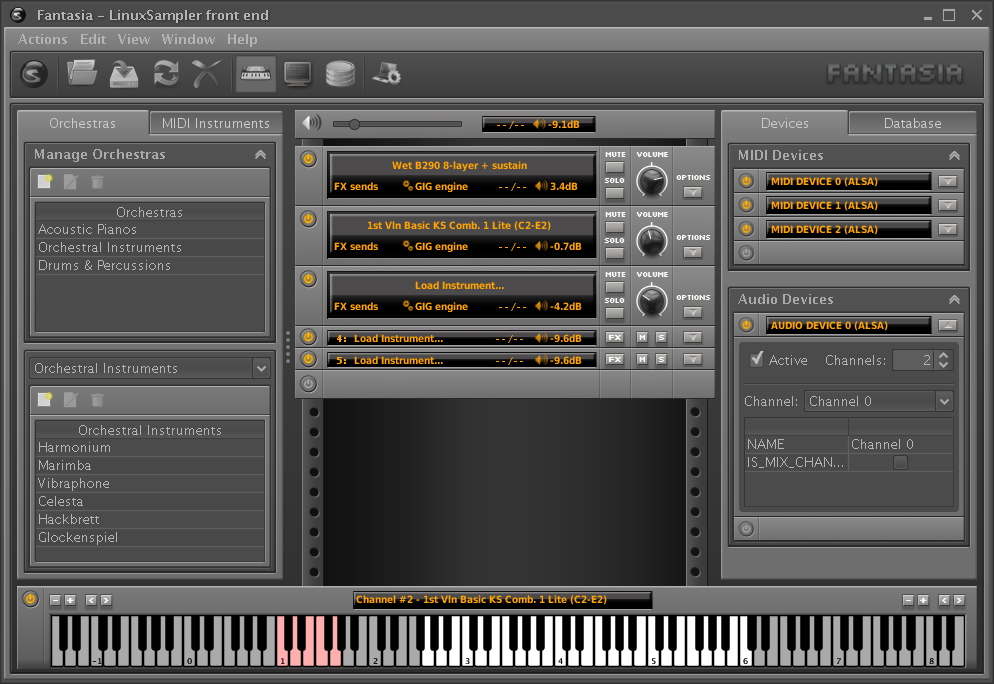

Fantasia - a front-end for LinuxSampler
=======================================

by Grigor Iliev <grigor@grigoriliev.com>

The Latest Version
==================

The latest version can be downloaded from
https://github.com/grigoriliev/jsampler-fantasia/releases

See also: http://www.linuxsampler.org/downloads.html

License
=======

This software is licensed under the terms of
the GNU Affero General Public License v3.0 (see LICENSE.md file).

Manual
======

The manual can be found [here](https://grigoriliev.github.io/jsampler-fantasia/).

Credits
=======

Special thanks to Olivier Boyer - the creator
of the initial graphic design of Fantasia.

For more information read the manual, which is located at `manual' directory.
Thanks for using JSampler.

